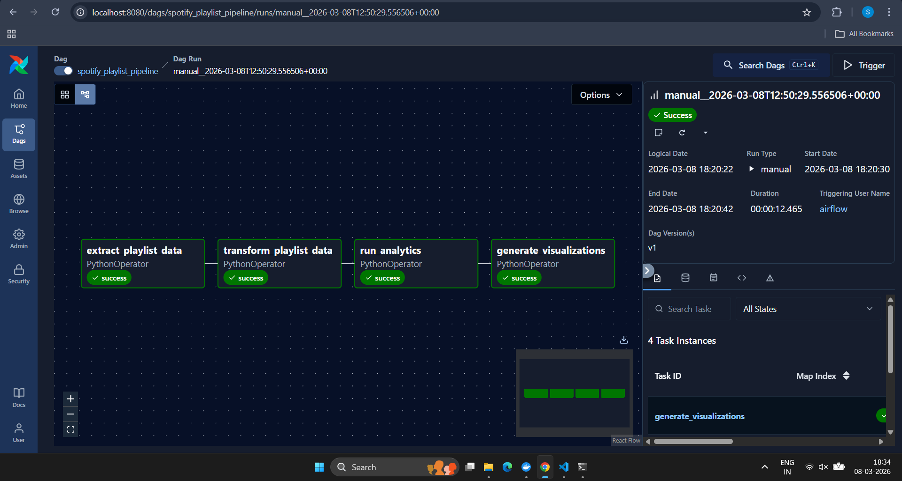

# Spotify Playlist Data Pipeline (Apache Airflow)

This project implements a simple **ETL data pipeline using Apache Airflow and Docker** to process Spotify playlist data and generate insights.

The pipeline demonstrates how **data workflows can be orchestrated using Airflow DAGs** and processed using Python data tools.

---

# Pipeline Stages

The pipeline consists of four stages:

1. **Extract** – Fetch playlist data from a dataset  
2. **Transform** – Clean and structure the data  
3. **Analytics** – Generate playlist statistics  
4. **Visualization** – Create charts from the processed data  

---

# Airflow DAG Workflow

```
extract_playlist_data
        ↓
transform_playlist_data
        ↓
run_analytics
        ↓
generate_visualizations
```

---

# Tech Stack

- Apache Airflow  
- Docker  
- Python  
- Pandas  
- Seaborn  
- Matplotlib  

---

# Project Structure

```
spotify-airflow-pipeline
│
├── config
│
├── dags
│   ├── analytics.py
│   ├── config.py
│   ├── data_transformer.py
│   ├── mood_classifier.py
│   ├── spotify_extractor.py
│   ├── spotify_playlist_pipeline_dag.py
│   └── visualization.py
│
├── logs
├── output
│   ├── reports
│   ├── visuals
│   ├── playlist_raw.csv
│   └── playlist_transformed.csv
│
├── plugins
├── docker-compose.yaml
└── README.md
```

---

# Running the Project

### 1. Clone the repository

```
git clone https://github.com/Sankethhhhhhh/Skill_lab.git
cd spotify-airflow-pipeline
```

---

### 2. Start Airflow

```
docker compose up -d
```

---

### 3. Open Airflow UI

```
http://localhost:8080
```

Default login:

```
username: airflow
password: airflow
```

---

### 4. Run the Pipeline

1. Enable the DAG **spotify_playlist_pipeline**
2. Click **Trigger DAG**

---

# Pipeline Execution

Successful DAG execution in Airflow:



---

# Author

Sanketh  
AI/ML Student