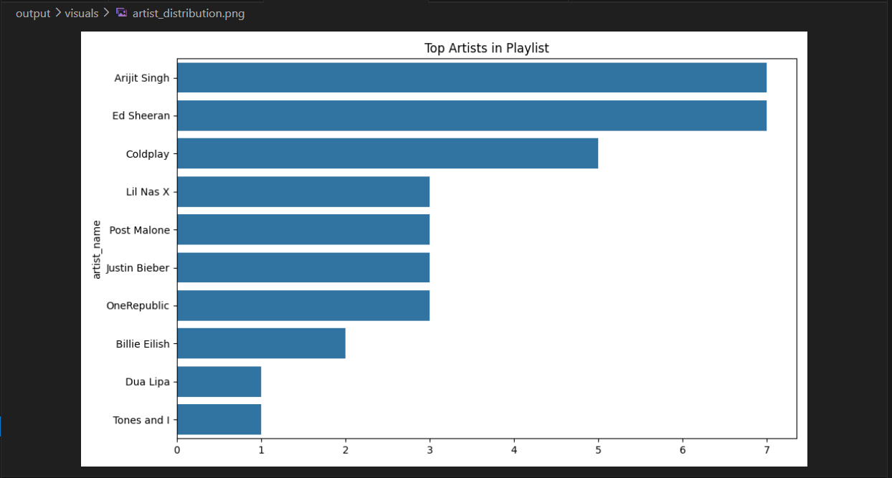

# Spotify Playlist Data Pipeline (Apache Airflow)

This project implements an **end-to-end ETL pipeline using Apache Airflow and Docker** to process Spotify playlist data and generate analytics and visualizations.

The pipeline demonstrates how **data engineering workflows are orchestrated with Airflow DAGs**, containerized using Docker, and processed using Python data tools.

---

# Pipeline Overview

The Airflow pipeline consists of four stages:

1. **Extract**
   - Fetch playlist data from a JSON dataset (simulating Spotify API)

2. **Transform**
   - Clean and structure the dataset
   - Classify songs by mood

3. **Analytics**
   - Generate statistical insights about the playlist

4. **Visualization**
   - Generate charts to analyze playlist characteristics

---

# Airflow DAG Workflow

```
extract_playlist_data
        ↓
transform_playlist_data
        ↓
run_analytics
        ↓
generate_visualizations
```

---

# Tech Stack

- Apache Airflow
- Docker
- Python
- Pandas
- Seaborn
- Matplotlib

---

# Project Structure

```
spotify-airflow-pipeline
│
├── config
│
├── dags
│   ├── analytics.py
│   ├── config.py
│   ├── data_transformer.py
│   ├── mood_classifier.py
│   ├── spotify_extractor.py
│   ├── spotify_playlist_pipeline_dag.py
│   └── visualization.py
│
├── logs
│
├── output
│   ├── reports
│   ├── visuals
│   ├── playlist_raw.csv
│   └── playlist_transformed.csv
│
├── plugins
│
├── .env
├── docker-compose.yaml
└── README.md
```

---

# Running the Project

## 1. Clone the repository

```
git clone https://github.com/Sankethhhhhhh/Skill_lab.git
cd spotify-airflow-pipeline
```

---

## 2. Start Airflow using Docker

```
docker compose up -d
```

This will start:

- Airflow Scheduler
- Airflow Webserver
- Redis
- PostgreSQL
- Airflow Worker

---

## 3. Open Airflow UI

```
http://localhost:8080
```

Default login:

```
username: airflow
password: airflow
```

---

## 4. Run the Pipeline

1. Open **DAGs**
2. Enable **spotify_playlist_pipeline**
3. Click **Trigger DAG**

The pipeline will execute all ETL stages automatically.

---

# Output Files

After the pipeline runs successfully, the generated outputs will appear in:

```
output/
```

### Processed Data

```
output/playlist_raw.csv
output/playlist_transformed.csv
```

### Analytics Report

```
output/reports/
```

Example:

```
summary_report.txt
```

### Visualizations

Charts generated by the pipeline are stored in:

```
output/visuals/
```

---

# Example Pipeline Execution

Add your Airflow DAG screenshot here.

```
images/dag_success.png
```

Example:


---

# Example Dataset Output

Preview of transformed playlist dataset.


---

# Example Visualization

Generated analytics charts.



---

# Learning Outcomes

This project demonstrates:

- Building **data pipelines using Apache Airflow**
- Containerized workflows using **Docker**
- Data transformation using **Pandas**
- Automated analytics pipelines
- Visualization generation in ETL workflows

---

# Author

Sanketh  
AI/ML Student

---

# Future Improvements

Possible extensions:

- Integrate real **Spotify API**
- Store data in **PostgreSQL / Data Warehouse**
- Build **Streamlit dashboard**
- Automate daily pipeline scheduling